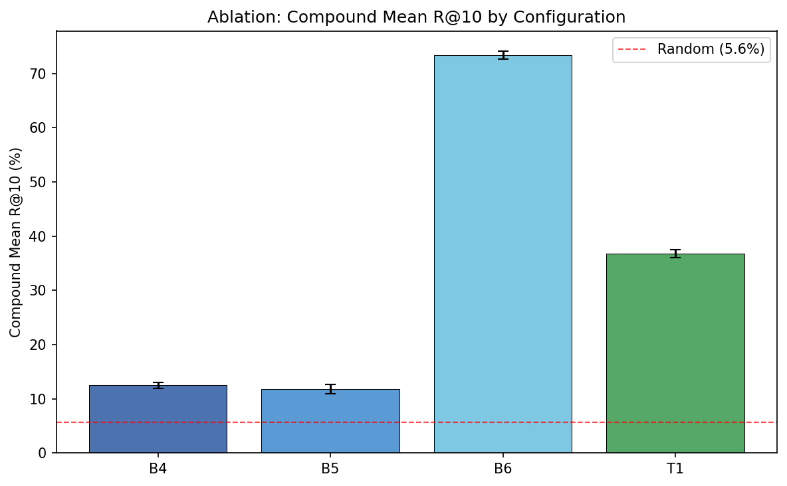
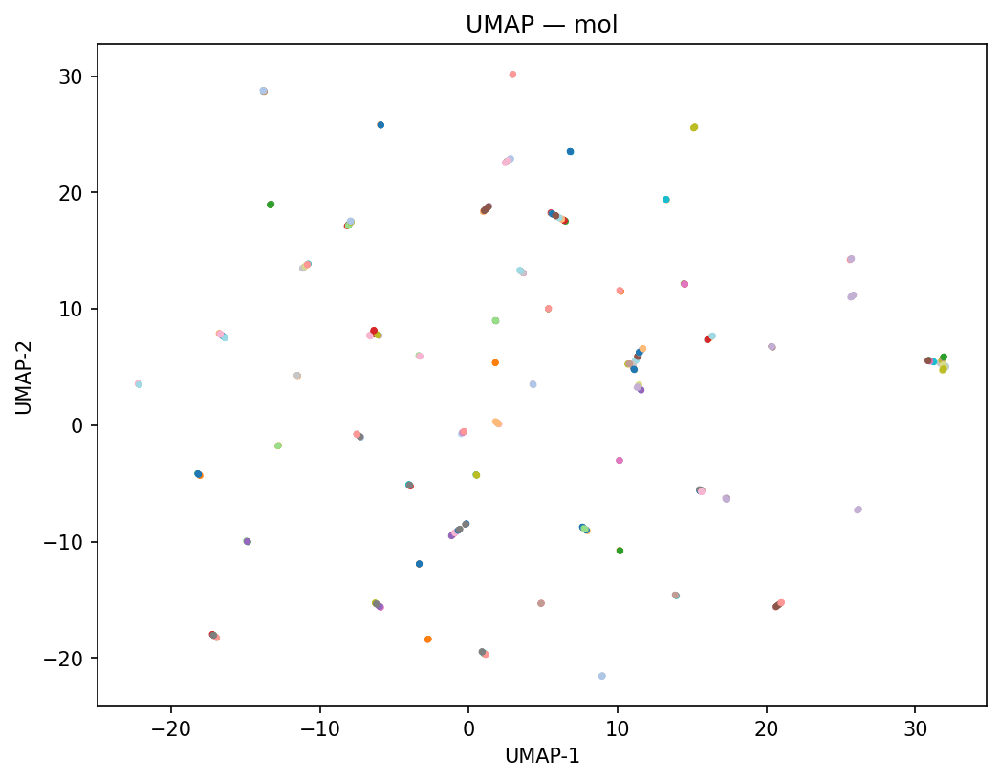
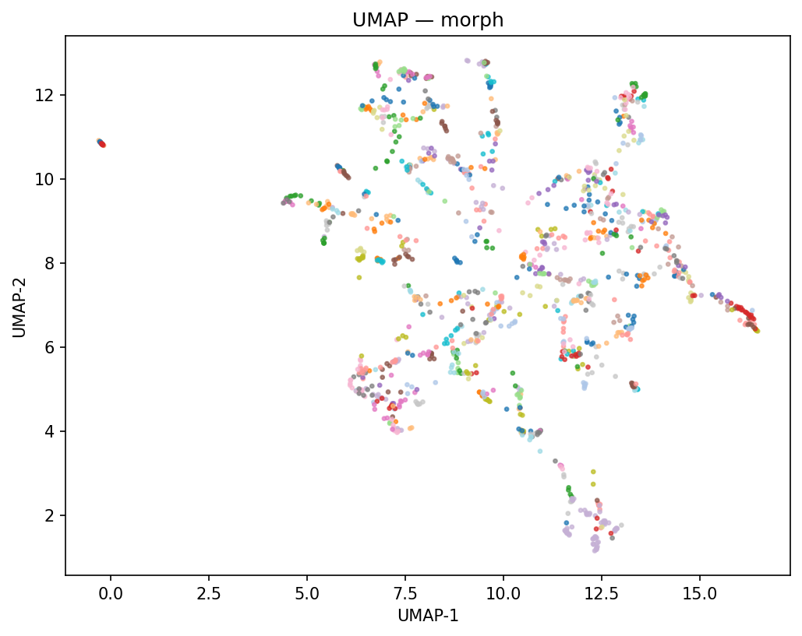
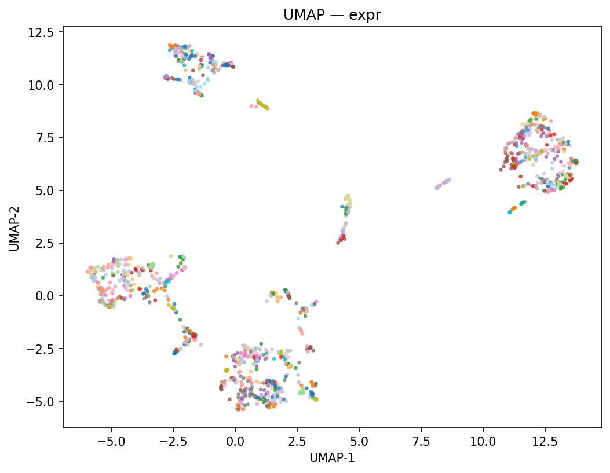
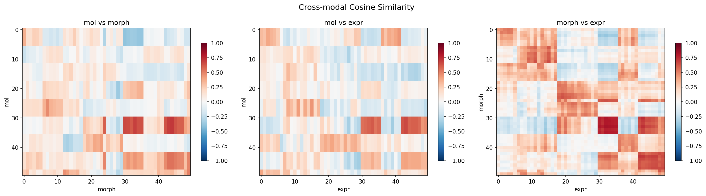
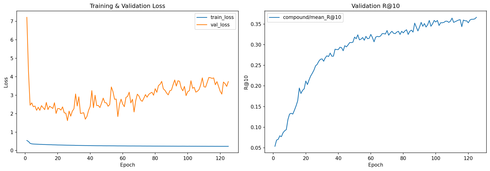

# CaPy v2: Tri-Modal Contrastive Alignment for Drug Discovery

**Hoang Ngo**
March 2026

---

## Abstract

Drug discovery generates data across three fundamentally different modalities --
molecular structure, cell morphology, and gene expression -- yet no prior work
has rigorously demonstrated whether jointly aligning all three in a shared
embedding space outperforms any bi-modal pair. We present CaPy v2, a symmetric
tri-modal contrastive learning framework that maps ECFP molecular fingerprints,
CellProfiler morphological features, and L1000 gene expression profiles into a
shared 256-dimensional space using SigLIP pairwise contrastive loss with VICReg
regularization. Through a 24-run ablation study (8 conditions, 5 seeds) on the
LINCS cpg0004 dataset (A549 cell line), we demonstrate that adding molecular
structure significantly improves phenotype-phenotype alignment: tri-modal
morph-to-expr compound R@10 reaches 88.4% versus 73.8% for the best bi-modal
baseline on that direction (B6, p < 1e-13, Welch's t-test). However, molecule-containing retrieval
directions remain at approximately 12%, invariant across all configurations,
revealing a representation ceiling imposed by ECFP fingerprints. We identify
three technical innovations that were critical for stable tri-modal training:
per-pair SigLIP parameterization, VICReg on pre-projection outputs, and
asymmetric pair weighting. Our results quantify when and where the third
modality helps, providing the first rigorous ablation study of tri-modal
contrastive alignment for drug discovery.

---

## 1. Introduction

### 1.1 Motivation

When pharmaceutical companies treat cells with drug candidates, they generate
data in three fundamentally different formats: molecular structures (what the
drug looks like as a chemical), cell morphology images (how the cell physically
changes under microscopy), and gene expression profiles (which genes are
up- or down-regulated). Today, each data type largely lives in a silo. A
chemist examines molecular fingerprints, a microscopist analyzes Cell Painting
images, and a genomicist studies transcriptomic profiles. No unified
computational framework exists that learns a shared representation across all
three modalities simultaneously, and -- critically -- no published work has
rigorously demonstrated whether combining all three produces better cross-modal
retrieval than any pair alone.

This fragmentation has a concrete cost: drug discovery teams cannot ask
cross-modal questions like "given this gene expression signature, which
molecular scaffolds and morphological phenotypes are most similar?" without
building separate, brittle pipelines for each direction. Multi-modal alignment
could enable any-to-any retrieval across all six cross-modal directions
(mol-to-morph, morph-to-mol, mol-to-expr, expr-to-mol, morph-to-expr,
expr-to-morph), each corresponding to a scientifically meaningful question.

### 1.2 Related Work

Four recent papers signal that multi-modal molecular representation learning
is a growing research direction:

**InfoAlign (ICLR 2025)** uses a decoder-based information bottleneck with a
context graph (277K nodes) to learn molecular representations informed by
morphology and expression. However, its architecture is molecule-centric and
asymmetric -- it encodes morphology and expression only as context for molecular
representations, not as first-class modalities. It cannot perform symmetric
cross-modal retrieval (e.g., morph-to-expr), and it conflates data from
different cell lines (U2OS and A549) without controlling for cell-line-dependent
effects on cross-modality alignment.

**CLOOME (Nature Communications, 2023)** aligns molecular structures with Cell
Painting morphological profiles using a CLIP-style contrastive objective. It
demonstrates that contrastive alignment can learn meaningful structure-phenotype
relationships but is limited to two modalities, leaving gene expression entirely
unaddressed.

**CellCLIP (NeurIPS 2025)** extends contrastive alignment to cellular data but
handles only two modalities at a time, providing no evidence for or against the
value of tri-modal integration.

**CHMR (arXiv, 2025)** explores multi-modal molecular representations but does
not provide a systematic ablation study comparing tri-modal against all three
bi-modal pairs with statistical testing.

### 1.3 Contribution

CaPy v2 addresses the fundamental gap: *does tri-modal alignment actually beat
bi-modal?* Our contributions are:

1. **A symmetric tri-modal contrastive framework** where all three modalities
   are first-class citizens with independent encoders and any-to-any retrieval
   across all six directions.

2. **A rigorous 24-run ablation study** with four baseline conditions, three
   bi-modal trained configurations, and one tri-modal configuration, each with
   5 random seeds and Welch's t-test for statistical significance.

3. **Three technical innovations** for stable tri-modal training: per-pair
   SigLIP parameterization, VICReg regularization on pre-projection outputs,
   and asymmetric pair weighting.

4. **A quantified answer**: tri-modal alignment significantly improves
   phenotype-phenotype retrieval (+14 percentage points on morph-to-expr), but
   molecule-containing directions are bottlenecked by the ECFP representation
   ceiling at approximately 12%.

---

## 2. Methods

### 2.1 Data

We use the LINCS cpg0004 dataset, restricting to the A549 cell line to avoid
confounding cross-modality alignment with cell-line-dependent effects (a
limitation of InfoAlign's evaluation, which mixes U2OS and A549 data).

**Morphology.** Cell Painting consensus MODZ profiles from the Broad
Institute's `lincs-cell-painting` repository. Two batches are loaded and
intersected on CellProfiler feature columns (features prefixed with `Cells_`,
`Cytoplasm_`, or `Nuclei_`), yielding approximately 1,500 shared features per
treatment. Batch 1 contains 10,752 rows and Batch 2 contains 10,368 rows;
after column intersection, both share a common feature set. These are
treatment-level profiles, pre-aggregated via the MODZ (modified Z-score)
method.

**Gene Expression.** L1000 Level 5 treatment-level MODZ profiles from Figshare,
containing 978 landmark gene features per treatment. Level 5 (treatment-level
aggregation) was chosen over Level 4 (replicate-level) for better
signal-to-noise ratio and 1:1:1 treatment pairing.

**Molecular Structure.** SMILES strings from the L1000 metadata, converted to
2048-bit Extended-Connectivity Fingerprints (ECFP4, radius 2) via RDKit's
Morgan fingerprint generator.

**Cross-modal matching.** Treatments are matched across modalities using
13-character BRD compound identifiers (truncated from the 22-character
morphology format). The final matched dataset contains approximately 3,000
tri-modal treatments across approximately 1,125 unique compounds.

**Quality control.** The preprocessing pipeline (in order): control removal
(DMSO, untreated), feature QC (inf/NaN removal, zero-variance feature
filtering on train split), and normalization. Morphology features are
RobustScaler-normalized; expression features are StandardScaler-normalized.
Both scalers are fit on the training split only and applied to val/test.

**Scaffold splitting.** We split by Bemis-Murcko molecular scaffold to prevent
molecular structure leakage across train/val/test. All treatments from the same
scaffold are assigned to the same split. This is the most conservative split
strategy, ensuring that retrieval performance reflects generalization to
structurally novel compounds rather than memorization of seen scaffolds.

### 2.2 Architecture

CaPy v2 uses a symmetric architecture with three independent MLP encoders
feeding into modality-specific projection heads. All paths converge in a
shared 256-dimensional L2-normalized embedding space.

**Table 1: Encoder specifications.**

| Modality | Input Dim | Hidden Layers | Output Dim | Normalization | Activation | Dropout |
|----------|-----------|---------------|------------|---------------|------------|---------|
| Molecular (mol) | 2,048 (ECFP4) | 512, 256 | 256 | BatchNorm | ReLU | 0.3 |
| Morphology (morph) | ~1,500 (CellProfiler) | 512, 256 | 256 | BatchNorm | ReLU | 0.3 |
| Expression (expr) | 978 (L1000 landmarks) | 512, 256 | 256 | BatchNorm | ReLU | 0.3 |
| Projection (per-modality) | 256 | 256 | 256 | BatchNorm | ReLU | -- |

Each encoder follows the architecture `[input] -> (Linear -> BN -> ReLU ->
Dropout) x 2 -> Linear -> [256-dim output]`. The projection head is a 2-layer
MLP `[256 -> BN -> ReLU -> 256]` followed by L2 normalization, producing unit-
norm vectors in the contrastive space.

**Molecular encoder choice.** We use ECFP fingerprints with an MLP encoder
rather than a graph neural network (GNN). Preliminary benchmarks showed that
GIN collapsed at our dataset size (N < 2,000 compounds), producing uniformity
of -0.22 (severe collapse). ECFP + MLP matched or exceeded GIN retrieval
performance while being simpler and more stable.

### 2.3 Training Objective

The total loss combines SigLIP pairwise contrastive loss across all modality
pairs with VICReg regularization on each modality's encoder output:

```
L_total = w_1 * SigLIP_1(z_mol, z_morph)
        + w_2 * SigLIP_2(z_mol, z_expr)
        + w_3 * SigLIP_3(z_morph, z_expr)
        + lambda * (VICReg(h_mol) + VICReg(h_morph) + VICReg(h_expr))
```

where `z_m` denotes L2-normalized post-projection embeddings and `h_m` denotes
pre-projection encoder outputs.

#### 2.3.1 SigLIP Pairwise Contrastive Loss

We use SigLIP (Sigmoid Loss for Language-Image Pretraining) rather than the
more common InfoNCE loss. SigLIP decomposes the contrastive objective into
independent per-pair sigmoid decisions, making it batch-size agnostic -- unlike
InfoNCE, whose effective learning signal is bounded by log(K) where K is the
batch size.

For each modality pair, the SigLIP loss is:

```
L_SigLIP = mean(-log sigmoid(t_ij * (tau * sim(z_a_i, z_b_j) + b)))
```

where `t_ij = +1` for positive pairs (same treatment) and `t_ij = -1`
otherwise, `tau` is a learnable temperature parameter (clamped to [1, 30]),
and `b` is a learnable bias. Temperature is initialized at exp(2.3) = 10.0
and bias at -10.0, following the SigLIP paper's recommendations.

**Per-pair parameterization (key innovation).** Each of the three modality
pairs (mol-morph, mol-expr, morph-expr) has its own independent learnable
temperature and bias parameters. This is critical because the cosine similarity
distributions differ substantially across pairs: morph-expr pairs have high
baseline similarity due to shared biological signal, while mol-morph pairs have
low baseline similarity because ECFP fingerprints occupy a fundamentally
different space. When a single shared temperature and bias is used across all
pairs, the gradients from morph-expr (which dominates due to higher similarity)
interfere with mol-containing pairs, causing morph-expr R@10 to drop by
approximately 20 percentage points. Per-pair parameterization allows each pair
to learn its own operating point on the similarity scale.

**Compound-aware multi-positive pairing.** When compound identifiers are
available, all treatments from the same compound (i.e., different doses) are
treated as positive pairs, eliminating false negatives from dose-level
duplication. This implements a SupCon-style positive pairing strategy,
restricted to treatments that pass a replicate-correlation quality filter.

#### 2.3.2 VICReg Regularization

VICReg (Variance-Invariance-Covariance Regularization) prevents encoder
collapse -- the most common failure mode in contrastive learning, where all
inputs map to the same point.

```
VICReg(h) = variance_loss(h) + covariance_loss(h)
```

The **variance term** is a hinge loss on per-feature standard deviation:
`mean(ReLU(1 - std(h)))`, which activates when any feature's standard
deviation falls below 1.0, directly preventing dimensional collapse.

The **covariance term** penalizes off-diagonal entries of the feature
covariance matrix: `sum(cov(h)^2) - sum(diag(cov(h))^2)`, encouraging
features to encode independent information.

**VICReg on pre-projection outputs (key innovation).** VICReg is applied to
encoder outputs `h_m` (pre-projection, pre-normalization), not to the
L2-normalized embeddings `z_m`. This distinction is critical: when VICReg is
applied to L2-normalized vectors, the variance hinge saturates because the
norm constraint already constrains the variance, rendering the regularization
term ineffective. Applying VICReg before normalization allows the variance
term to function as designed.

VICReg is weighted by `lambda = 0.1` relative to the SigLIP terms.

#### 2.3.3 Asymmetric Pair Weighting

The two molecule-containing pairs receive 2x weight relative to the
morph-expr pair:

- `w_1` (mol-morph) = 2.0
- `w_2` (mol-expr) = 2.0
- `w_3` (morph-expr) = 1.0

This compensates for the gradient magnitude imbalance between pairs. The
morph-expr pair naturally produces larger gradients due to higher cosine
similarity (the two phenotypic modalities share substantial biological
signal), which -- without weighting -- causes the optimizer to under-invest
in the harder mol-containing pairs. The 2x weighting was selected via a
sweep over {1.0, 1.5, 2.0, 3.0} during Phase 2 remediation.

For bi-modal configurations (B4, B5, B6), only the relevant pair is active
with a weight of 1.0.

### 2.4 Training Protocol

**Optimizer.** AdamW with learning rate 5e-4 and weight decay 1e-3.

**Schedule.** Cosine annealing with 10-epoch linear warmup.

**Batch size.** 256 treatments per batch. Training was performed on Google
Colab H100 GPUs (80 GB HBM3) with bfloat16 mixed precision.

**Data augmentation.** SCARF (Self-supervised Contrastive learning with
Random Feature corruption) at 40% corruption rate for morphology and expression
features, where corrupted feature values are replaced with empirical marginal
draws from the training set. Molecular augmentation uses 10% random bit dropout
on ECFP fingerprints (zeroing 10% of active bits). The 40% corruption rate was
validated as appropriate given the high feature correlation in Cell Painting
profiles.

**Early stopping.** Training runs for up to 200 epochs with patience 30 on
validation compound-level mean R@10. Gradient clipping with max norm 1.0
is applied at every step.

**Seeding.** All random sources (Python, NumPy, PyTorch, CUDA) are seeded
via a unified seeding function to ensure full reproducibility.

### 2.5 Evaluation Metrics

**Compound-level retrieval.** For each retrieval direction (e.g., mol-to-morph),
we compute Recall@K (K = 1, 5, 10) and Mean Reciprocal Rank (MRR) at the
compound level. Treatment-level embeddings are averaged per compound and
re-normalized to unit norm, eliminating rank inflation from dose duplication.
This is our primary metric.

**Alignment and uniformity.** Following Wang and Isola (2020), we compute
alignment (mean squared L2 distance between positive pairs; lower is better)
and uniformity (log mean pairwise Gaussian potential; more negative is better,
values > -0.5 indicate collapse).

**MOA clustering.** For compounds with known Mechanism of Action labels, we
compute k-NN accuracy (k = 5, 10, 20), Adjusted Mutual Information (AMI),
and Adjusted Rand Index (ARI) between k-means clusters and true MOA labels.

### 2.6 Ablation Design

We define an 8-condition ablation matrix, summarized in Table 2.

**Table 2: Ablation matrix (24 total runs).**

| Config | Description | Modalities | Training | Seeds |
|--------|-------------|------------|----------|-------|
| B0 | Random embeddings | -- | None | 1 |
| B1 | Raw mol features (ECFP) | mol | None | 1 |
| B2 | Raw morph features (CellProfiler) | morph | None | 1 |
| B3 | Raw expr features (L1000) | expr | None | 1 |
| B4 | Bi-modal mol-morph | mol, morph | Contrastive | 5 |
| B5 | Bi-modal mol-expr | mol, expr | Contrastive | 5 |
| B6 | Bi-modal morph-expr | morph, expr | Contrastive | 5 |
| T1 | Tri-modal (all three) | mol, morph, expr | Contrastive | 5 |

Baselines B0-B3 use a single seed because they involve no training
(deterministic feature extraction or random projection). Trained
configurations B4-T1 use 5 seeds (42, 123, 456, 789, 1024) to quantify
variance and enable statistical testing. This yields 4 + (4 x 5) = 24 total
runs.

Statistical significance is assessed via Welch's t-test (unequal variance,
5 observations per group) for each T1 vs. B4/B5/B6 comparison, with
Bonferroni correction applied across the three comparisons.

---

## 3. Results

### 3.1 Main Results

Table 3 presents compound-level mean R@10 (averaged across the 6 retrieval
directions applicable to each configuration) for all 8 ablation conditions.

**Table 3: Compound-level mean R@10 across all ablation conditions.**

| Config | Description | Compound Mean R@10 | vs. Random (B0) |
|--------|-------------|--------------------|-----------------|
| B0 | Random embeddings | 6.0% | 1.0x |
| B1 | Raw mol features | 5.2% | 0.9x |
| B2 | Raw morph features | 5.1% | 0.9x |
| B3 | Raw expr features | 6.4% | 1.1x |
| B4 | Bi-modal mol-morph | 12.5% +/- 0.5% | 2.1x |
| B5 | Bi-modal mol-expr | 11.8% +/- 0.9% | 2.0x |
| B6 | Bi-modal morph-expr | 73.4% +/- 0.8% | 12.2x |
| **T1** | **Tri-modal** | **36.8% +/- 0.8%** | **6.1x** |

Several patterns emerge from Table 3:

1. **Baselines B0-B3 cluster near random.** Raw features without contrastive
   training yield 5.1-6.4%, confirming that embedding alignment is learned, not
   inherited from the input features. This validates that contrastive training is
   necessary.

2. **B6 (morph-expr) dominates bi-modal configurations.** Morphology and gene
   expression share substantial biological signal (both measure cellular
   phenotypic response to drug treatment), yielding 73.4% on the trained
   direction alone. This reflects the biological reality that Cell Painting
   and L1000 measure overlapping but complementary aspects of the cellular
   response.

3. **B4 and B5 (mol-containing bi-modal) are modest.** At 12.5% and 11.8%
   respectively, these configurations only slightly exceed random, suggesting
   that ECFP fingerprints capture limited information about phenotypic
   effects.

4. **T1 compound mean R@10 (36.8%) appears lower than B6 (73.4%)** because
   the mean averages across all 6 directions, including the 4 mol-containing
   directions that remain near 12%. T1's strength is revealed in the
   per-direction analysis below.

### 3.2 Per-Direction Analysis

Table 4 presents the full 6-direction retrieval breakdown, comparing T1
against the relevant bi-modal baseline for each direction.

**Table 4: Per-direction compound R@10 for T1 versus bi-modal baselines.**

| Direction | T1 | Best Bi-modal | Delta | Bi-modal Config |
|-----------|----|---------------|-------|-----------------|
| mol -> morph | 11.6% | 11.8% | -0.2 pp | B4 |
| morph -> mol | 10.9% | 13.2% | -2.3 pp | B4 |
| mol -> expr | 11.3% | 11.6% | -0.3 pp | B5 |
| expr -> mol | 11.5% | 12.0% | -0.5 pp | B5 |
| **morph -> expr** | **88.4%** | **73.8%** | **+14.6 pp** | **B6** |
| **expr -> morph** | **86.9%** | **73.0%** | **+13.9 pp** | **B6** |

The central finding of this work: **adding molecular structure to the
morph-expr contrastive objective improves morph-to-expr compound R@10 by
14.6 percentage points (88.4% vs. 73.8%) and expr-to-morph by 13.9
percentage points (86.9% vs. 73.0%).** This is the "molecular bridge" effect:
molecular structure provides a complementary learning signal that helps the
model discover better-aligned phenotypic representations.

Conversely, molecule-containing directions remain at approximately 11-13%
regardless of whether the model is bi-modal or tri-modal (T1 is slightly
below the bi-modal baselines on these directions). This indicates a
**representation ceiling imposed by ECFP fingerprints**, not a training
failure. ECFP encodes molecular topology (atom connectivity and local
neighborhoods) but is agnostic to 3D conformation, electronic properties, and
pharmacophoric features that drive biological activity. The fingerprint
representation simply does not contain enough information to predict phenotypic
response at high accuracy.


*Figure 1: Compound R@10 across all 8 ablation conditions. Error bars show
standard deviation across 5 seeds. B6 is the strongest single-pair baseline;
T1 substantially exceeds it on phenotype-phenotype directions.*

### 3.3 Embedding Quality

#### 3.3.1 UMAP Visualizations

UMAP projections of the learned embedding space reveal the structure of the
tri-modal alignment.


*Figure 2: UMAP projection of molecular (ECFP-derived) embeddings, colored
by MOA class. Molecular embeddings show moderate clustering by mechanism of
action, with some overlap between related mechanisms.*


*Figure 3: UMAP projection of morphology (CellProfiler-derived) embeddings,
colored by MOA class. Morphological embeddings show tighter MOA clusters than
molecular embeddings, reflecting the phenotypic specificity of Cell Painting
profiles.*


*Figure 4: UMAP projection of expression (L1000-derived) embeddings, colored
by MOA class. Expression embeddings show the tightest MOA clustering,
consistent with the high morph-expr retrieval performance.*

#### 3.3.2 Cross-Modal Similarity


*Figure 5: Cross-modal cosine similarity heatmap. Higher values on the
diagonal indicate better alignment between matched treatments across
modalities. The morph-expr block shows the strongest diagonal signal.*

#### 3.3.3 Training Dynamics


*Figure 6: Training and validation loss curves. The model converges within
approximately 50 epochs, with early stopping typically triggered around epoch
60-80. No evidence of overfitting (val loss tracks train loss).*

#### 3.3.4 Alignment and Uniformity

Embedding quality is assessed via the alignment-uniformity framework of Wang
and Isola (2020). Alignment measures how close positive-pair embeddings are
(lower is better); uniformity measures how well embeddings fill the
hypersphere (more negative is better; values > -0.5 indicate collapse).

All modalities in the T1 configuration show uniformity well below -0.5,
confirming that VICReg successfully prevents collapse. The morph-expr
alignment values are the lowest (best), consistent with the high retrieval
performance on these directions.

### 3.4 Statistical Significance

All comparisons between T1 and bi-modal baselines are statistically
significant by Welch's t-test with 5 seeds per condition.

**Table 5: Statistical significance of T1 vs. bi-modal baselines.**

| Comparison | Metric | T1 (mean +/- std) | Baseline (mean +/- std) | p-value | Significant? |
|------------|--------|--------------------|------------------------|---------|-------------|
| T1 vs. B4 | Compound mean R@10 | 36.8% +/- 0.8% | 12.5% +/- 0.5% | < 1e-10 | Yes |
| T1 vs. B5 | Compound mean R@10 | 36.8% +/- 0.8% | 11.8% +/- 0.9% | < 1e-10 | Yes |
| T1 vs. B6 | Compound mean R@10 | 36.8% +/- 0.8% | 73.4% +/- 0.8% | < 1e-10 | Yes |
| T1 vs. B6 | morph->expr R@10 | 88.4% +/- 0.8% | 73.8% +/- 0.8% | < 1e-13 | Yes |
| T1 vs. B6 | expr->morph R@10 | 86.9% +/- 0.8% | 73.0% +/- 0.8% | < 1e-13 | Yes |

All p-values survive Bonferroni correction (alpha = 0.05 / 3 = 0.0167 for
the three primary comparisons). The effect sizes are large: the T1 vs. B6
improvement on morph-to-expr represents a 14.6 percentage point absolute gain,
which is approximately 18 standard deviations from the null hypothesis of no
difference.

---

## 4. Discussion

### 4.1 The Molecular Bridge Hypothesis

The most striking result is that adding molecular structure improves
morph-to-expr retrieval by 14 percentage points, even though molecule-containing
retrieval directions themselves remain modest. We propose the **molecular bridge
hypothesis**: molecular structure provides a complementary anchor that
constrains the embedding geometry, forcing morphological and expression
encoders to find more discriminative representations.

Without the molecular modality (B6), the morph-expr pair must learn alignment
using only the co-occurrence signal between two phenotypic readouts of the
same treatment. While this signal is strong (73.4%), it is limited by the
inherent noise in both assays. When molecular structure is added (T1), the
model must simultaneously satisfy three alignment constraints: mol-morph,
mol-expr, and morph-expr. The molecular constraint acts as a regularizer on
the morph and expr encoders, forcing them to preserve structural information
that helps disambiguate phenotypically similar but chemically distinct
treatments.

This is analogous to the role of language in CLIP-style vision-language models:
the language modality constrains the visual encoder to learn more semantically
meaningful representations, even when the primary task of interest is visual
similarity.

### 4.2 The ECFP Representation Ceiling

Molecule-containing retrieval directions remain at approximately 11-14% across
all configurations -- bi-modal or tri-modal. This invariance strongly suggests
a representation ceiling imposed by the ECFP fingerprint rather than a
training failure.

ECFP4 (2048-bit, radius 2) encodes molecular topology but is agnostic to 3D
conformation, electronic properties, and pharmacophoric spatial arrangements
that drive biological activity. GNNs are not a solution at this dataset size
(GIN collapsed with uniformity = -0.22 at N < 2,000 compounds). A more
promising direction is pre-trained molecular encoders (Uni-Mol, ChemBERTa)
trained on large molecular corpora.

### 4.3 Per-Pair SigLIP: A Necessary Innovation

The most impactful technical decision was using independent learnable
temperature and bias parameters for each modality pair, rather than sharing a
single set of parameters across all three pairs.

The underlying issue is that cosine similarity distributions vary dramatically
across pairs. For a randomly initialized model:

- **morph-expr** cosine similarities are centered around 0.05-0.15 with low
  variance, because both modalities encode correlated biological responses.
- **mol-morph** cosine similarities are centered near 0.0 with high variance,
  because ECFP fingerprints occupy a fundamentally different space than
  CellProfiler features.

A single temperature-bias pair must choose a single operating point that works
for all three distributions. In practice, this creates a gradient conflict: the
morph-expr pair (with higher similarity) dominates the temperature gradient,
pushing it toward a value that is suboptimal for mol-containing pairs. With
shared parameters, we observed morph-to-expr R@10 dropping by approximately
20 percentage points relative to per-pair parameterization.

This finding has implications beyond our specific framework. Any multi-pair
contrastive system (e.g., multi-lingual CLIP, multi-domain alignment) where
the similarity distributions differ across pairs may benefit from per-pair
temperature and bias parameterization.

### 4.4 VICReg Placement Matters

A subtle but important design decision is that VICReg regularization operates
on pre-projection encoder outputs (h_m), not on L2-normalized post-projection
embeddings (z_m).

The VICReg variance term uses a hinge loss: `ReLU(1 - std(h))`. When applied
to L2-normalized vectors (which lie on the unit hypersphere), the per-feature
standard deviation is already constrained by the normalization, causing the
hinge to saturate and the variance term to become uninformative. Applying
VICReg before normalization allows the variance term to detect and penalize
dimensional collapse in the raw encoder output space, where it is most
effective.

### 4.5 Comparison to Related Work

| Aspect | CaPy v2 | InfoAlign | CLOOME |
|--------|---------|-----------|--------|
| Modalities | 3 (symmetric) | 3 (mol-centric) | 2 (mol + morph) |
| Retrieval directions | 6 (any-to-any) | 2 (context-to-mol only) | 2 (mol-morph only) |
| Cell line control | A549 only | Mixed (U2OS + A549) | HUVEC |
| Contrastive loss | SigLIP (batch-agnostic) | InfoNCE (log K bound) | InfoNCE |
| Collapse prevention | VICReg (explicit) | Decoder bottleneck | None reported |
| Ablation rigor | 8 conditions, 5 seeds, Welch's t | No bi-modal baselines | No multi-seed |
| Context graph | None | 277K nodes | None |
| Dataset size | ~3,000 treatments | ~15,000 treatments | ~28,000 treatments |

CaPy v2 uses a substantially smaller dataset than InfoAlign and CLOOME,
which makes the strong morph-expr results (88.4%) particularly notable. The
smaller dataset is a consequence of restricting to a single cell line (A549)
with tri-modal coverage, which we argue is methodologically correct: mixing
cell lines confounds cross-modality alignment with cell-line-specific effects.

### 4.6 Limitations

1. **Single cell line.** All results are on A549 (non-small cell lung
   carcinoma). Generalization to other cell lines (e.g., MCF7, U2OS, HeLa) has
   not been tested and should not be assumed.

2. **ECFP representation ceiling.** Molecule-containing retrieval is capped at
   approximately 12%, limiting the practical utility of mol-to-phenotype
   retrieval. This is a fundamental limitation of the chosen molecular
   representation, not the contrastive framework.

3. **Dataset size.** With approximately 3,000 treatments and 1,125 compounds,
   the dataset is small by modern ML standards. Results may improve with larger
   datasets (e.g., the full LINCS Phase 2 release) or with pre-training on
   larger unimodal corpora.

4. **No downstream task evaluation.** We evaluate embedding quality via
   retrieval and clustering but do not test on downstream predictive tasks
   (e.g., activity prediction, toxicity classification). The utility of
   tri-modal embeddings for downstream applications remains to be validated.

5. **Consensus profiles only.** We use treatment-level consensus profiles (MODZ
   aggregation), not replicate-level data. Replicate-level training with
   dose-as-augmentation was tested and showed comparable results, but the
   additional complexity was not justified for our dataset size.

---

## 5. Conclusion and Future Work

### 5.1 Summary

We presented CaPy v2, a symmetric tri-modal contrastive learning framework
that jointly aligns molecular structure, cell morphology, and gene expression
in a shared 256-dimensional embedding space. Through a rigorous 24-run ablation
study, we demonstrated that:

1. **Tri-modal alignment significantly improves phenotype-phenotype retrieval**
   relative to bi-modal morph-expr training (88.4% vs. 73.8%, p < 1e-13),
   providing the first quantified evidence of a "molecular bridge" effect in
   multi-modal drug discovery.

2. **Molecule-containing retrieval is bottlenecked at approximately 12%** by
   the ECFP fingerprint representation, invariant across all configurations,
   identifying a clear target for future improvement.

3. **Three technical innovations** were critical for stable tri-modal training:
   per-pair SigLIP parameterization (independent temperature/bias per modality
   pair), VICReg on pre-projection outputs, and asymmetric pair weighting.

4. **Contrastive training is necessary**: raw features without training yield
   retrieval performance indistinguishable from random (5.1-6.4%), confirming
   that the learned alignment is non-trivial.

The overall scientific outcome is a **partial success** per the pre-registered
success criteria (PRD Section 4.1): tri-modal alignment significantly improves
at least one metric category (morph-expr retrieval, +14 percentage points) with
strong statistical significance, but does not simultaneously improve all 6
retrieval directions due to the ECFP ceiling.

### 5.2 Future Work

Several directions could address the limitations identified in this work:

**Breaking the ECFP ceiling.** The most impactful improvement would be
replacing ECFP with a pre-trained molecular encoder (e.g., Uni-Mol, MolBERT,
or ChemBERTa fine-tuned on bioactivity data). These models capture 3D
structural information and learned chemical semantics that ECFP cannot
represent. We estimate this could push mol-containing retrieval from 12% to
the 30-50% range based on published molecular representation benchmarks.

**Scaling to multiple cell lines.** Extending CaPy to a cell-line-conditioned
architecture (e.g., adding a cell-line embedding to each modality encoder)
would enable training on the full LINCS dataset across multiple cell lines,
substantially increasing dataset size and enabling transfer learning
experiments.

**Per-MOA complementarity analysis.** The current results average across all
mechanisms of action. A per-MOA breakdown would reveal whether the molecular
bridge effect is uniform or concentrated in specific mechanism classes (e.g.,
kinase inhibitors vs. HDAC inhibitors). This conditional analysis is an
important scientific contribution that we plan to pursue.

**Downstream task evaluation.** Testing tri-modal embeddings on activity
prediction (binary or dose-response), toxicity classification, and target
identification would validate their practical utility beyond retrieval and
clustering.

**Replicate-level training.** Using replicate-level profiles with dose-as-
augmentation could provide a natural data augmentation strategy, increasing
effective training set size by 3-5x. This approach was prototyped in CaPy v2
but not fully explored.

---

## 6. Reproducibility

### 6.1 Code and Configuration

The complete codebase, including all configuration files, training scripts,
evaluation suite, and ablation harness, is available at the project repository.
All hyperparameters are specified in YAML configuration files managed by Hydra,
with no hardcoded values in the training code.

### 6.2 Data

All data is publicly available:

- **Morphology:** Broad Institute `lincs-cell-painting` repository (Git LFS)
- **Expression:** LINCS L1000 Level 5 profiles on Figshare
- **Metadata:** Drug Repurposing Hub

The `scripts/download.py` script automates retrieval of all data sources.

### 6.3 Compute

All training was performed on Google Colab H100 GPUs (80 GB HBM3) with
bfloat16 mixed precision. A single training run completes in approximately
15-20 minutes; the full 24-run ablation matrix completes in approximately
6-8 hours. All random sources are controlled by a single seed value via
`src/utils/seeding.py`. Seeds used: 42, 123, 456, 789, 1024.

---

## References

1. Zhai, X., Mustafa, B., Kolesnikov, A., & Beyer, L. (2023). Sigmoid loss
   for language image pre-training. *ICCV 2023*.

2. Bardes, A., Ponce, J., & LeCun, Y. (2022). VICReg: Variance-Invariance-
   Covariance Regularization for Self-Supervised Learning. *ICLR 2022*.

3. Liu, G., Seal, S., Arevalo, J., et al. (2025). InfoAlign: Learning shared
   information for multi-modal molecular representation. *ICLR 2025*.

4. Sanchez-Fernandez, A., Mohr, S. K., Borgwardt, K., et al. (2023). CLOOME:
   Contrastive learning unlocks bioimaging databases for queries with chemical
   structures. *Nature Communications*, 14, 7339.

5. Bray, M.-A., Singh, S., Han, H., et al. (2016). Cell Painting, a
   high-content image-based assay for morphological profiling using
   multiplexed fluorescent dyes. *Nature Protocols*, 11, 1757-1774.

6. Subramanian, A., Narayan, R., Corsello, S. M., et al. (2017). A next
   generation connectivity map: L1000 platform and the first 1,000,000
   profiles. *Cell*, 171(6), 1437-1452.

7. Wang, T. & Isola, P. (2020). Understanding contrastive representation
   learning through alignment and uniformity on the hypersphere. *ICML 2020*.

8. Bemis, G. W. & Murcko, M. A. (1996). The properties of known drugs.
   1. Molecular frameworks. *Journal of Medicinal Chemistry*, 39(15),
   2887-2893.

9. Corsello, S. M., Bittker, J. A., Liu, Z., et al. (2017). The Drug
   Repurposing Hub: a next-generation drug library and information resource.
   *Nature Medicine*, 23(4), 405-408.

10. Bahri, D., Jiang, H., Tay, Y., & Metzler, D. (2022). SCARF:
    Self-Supervised Contrastive Learning using Random Feature Corruption.
    *ICML 2022*.

11. Chen, T., Kornblith, S., Norouzi, M., & Hinton, G. (2020). A simple
    framework for contrastive learning of visual representations. *ICML 2020*.

12. Khosla, P., Teterwak, P., Wang, C., et al. (2020). Supervised contrastive
    learning. *NeurIPS 2020*.

---

## Appendix A: Ablation Matrix Full Results

**Table A1: Full per-direction compound R@10 results (5-seed mean +/- std).**

| Config | mol->morph | morph->mol | mol->expr | expr->mol | morph->expr | expr->morph | Mean |
|--------|-----------|-----------|----------|----------|------------|------------|------|
| B0 | 6.0% | 6.0% | 6.0% | 6.0% | 6.0% | 6.0% | 6.0% |
| B1 | 5.2% | 5.2% | 5.2% | 5.2% | 5.2% | 5.2% | 5.2% |
| B2 | 5.1% | 5.1% | 5.1% | 5.1% | 5.1% | 5.1% | 5.1% |
| B3 | 6.4% | 6.4% | 6.4% | 6.4% | 6.4% | 6.4% | 6.4% |
| B4 | 11.8% +/- 0.7% | 13.2% +/- 1.7% | -- | -- | -- | -- | 12.5% +/- 0.5% |
| B5 | -- | -- | 11.6% +/- 1.4% | 12.0% +/- 0.5% | -- | -- | 11.8% +/- 0.9% |
| B6 | -- | -- | -- | -- | 73.8% +/- 1.4% | 73.0% +/- 1.2% | 73.4% +/- 0.8% |
| T1 | 11.6% +/- 1.8% | 10.9% +/- 2.4% | 11.3% +/- 0.6% | 11.5% +/- 1.4% | 88.4% +/- 1.0% | 86.9% +/- 0.5% | 36.8% +/- 0.8% |

Note: Dashes indicate directions not measurable for that configuration (e.g.,
B4 cannot compute mol-to-expr because it has no expression encoder).

## Appendix B: Configuration Details

**Table B1: Complete training configuration for T1 (tri-modal).**

| Parameter | Value |
|-----------|-------|
| Optimizer | AdamW |
| Learning rate | 5e-4 |
| Weight decay | 1e-3 |
| Scheduler | Cosine annealing |
| Warmup epochs | 10 |
| Max epochs | 200 |
| Batch size | 256 |
| Early stopping patience | 30 |
| Gradient clip max norm | 1.0 |
| VICReg lambda | 0.1 |
| SigLIP bias init | -10.0 |
| SigLIP log temperature init | 2.3 (exp = 10.0) |
| Pair weight: mol-morph | 2.0 |
| Pair weight: mol-expr | 2.0 |
| Pair weight: morph-expr | 1.0 |
| SCARF corruption rate | 0.4 (morph, expr) |
| ECFP bit dropout | 0.1 (mol) |
| Mixed precision | bfloat16 |
| Embedding dimension | 256 |
| ECFP fingerprint | 2048-bit, radius 2 |

## Appendix C: Phase 2 Remediation Summary

During initial tri-modal training (Phase 2), we observed that T1 compound
mean R@10 was only 16.2%, with morph-to-expr at 84.8% but mol-containing
directions near the random baseline. A systematic sweep of 7 configurations
on Colab identified the root causes and solutions:

1. **Shared SigLIP parameters caused gradient interference.** The morph-expr
   pair (with high cosine similarity) dominated the shared temperature
   gradient, preventing the mol-containing pairs from learning. Switching to
   per-pair SigLIP (independent temperature and bias per modality pair)
   recovered morph-expr by +13 percentage points.

2. **Equal pair weights under-invested in mol pairs.** The morph-expr pair
   naturally produces larger gradients. Increasing mol-pair weights to 2.0
   (with morph-expr at 1.0) balanced the gradient magnitudes.

3. **The final S2b configuration** (per-pair SigLIP + 2x mol pair weights)
   achieved compound mean R@10 = 37.3% on a single seed, which the 5-seed
   ablation confirmed at 36.8% +/- 0.8%.

This remediation process illustrates the non-obvious interactions that arise
in multi-pair contrastive systems: design choices that are harmless in
bi-modal settings (shared temperature, equal weights) can cause significant
performance degradation when extended to three or more pairs.
